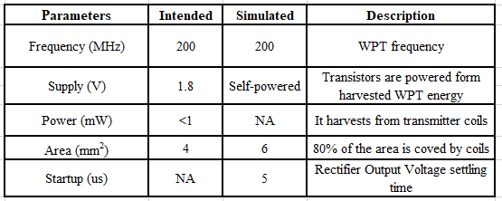
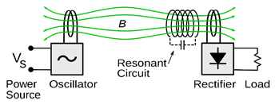
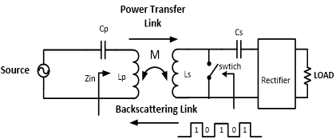
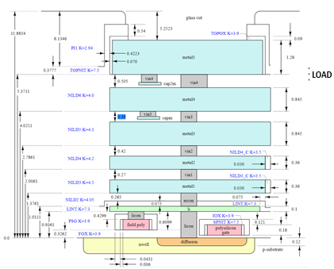

# Onchip-wpt-for-backscattering-system
Table of Contents
1.	Summary of design metrics
2.	What is resonant WPT
3.	On chip coil modeling using sky water 130 nm stack
4.	What is Active rectifier?
5.	Active Rectifier
6.	Active Rectifier using skywater 130pdk
7.	Layout Pictures
8.	Backscattering implementation
9.	Prerequisites
10.	Design files
11.	Running Simulations
### summary of design metrics
#### VDD = 1.8 V, TT corner
  
###  What is resonant WPT?
Wireless Power Transmission (WPT) realized using resonant coils coupled via their magnetic is known as resonant WPT fields. Primary and Secondary coils are loaded with capacitors which are tuned at same frequency. Despite of low coupling coefficients MCR-WPT provides high power transfer at a single resonant frequency.

  
  
### Note: 
Final design is limited to the on chip receiver coils, active reciter and a load. Backscattering Switch is implemented off chip to shunt the coil
### On chip WPT coil modeling using sky water 130 nm stack
Stack for the Inductive coils are modelled in ADS. Inductance of the coils is simulated using momentum simulations.

  
