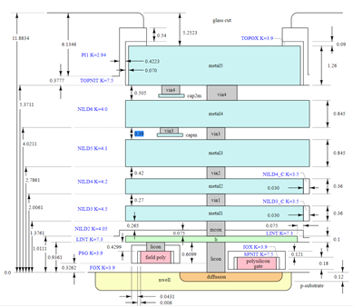

# Onchip-wpt-for-backscattering-system
Table of Contents
1.	Summary of design metrics
2.	What is resonant WPT
3.	On chip coil modeling using sky water 130 nm stack
4.	What is Active rectifier?
5.	Active Rectifier
6.	Active Rectifier using skywater 130pdk
7.	Layout Pictures
8.	Backscattering implementation
9.	Prerequisites
10.	Design files
11.	Running Simulations
### summary of design metrics
#### VDD = 1.8 V, TT corner
  
###  What is resonant WPT?
Wireless Power Transmission (WPT) realized using resonant coils coupled via their magnetic is known as resonant WPT fields. Primary and Secondary coils are loaded with capacitors which are tuned at same frequency. Despite of low coupling coefficients MCR-WPT provides high power transfer at a single resonant frequency.

  
  
### Note: 
Final design is limited to the on chip receiver coils, active reciter and a load. Backscattering Switch is implemented off chip to shunt the coil
### On chip WPT coil modeling using sky water 130 nm stack
Stack for the Inductive coils are modelled in ADS. Inductance of the coils is simulated using momentum simulations.

### Results 

For lower frequency inductance is around 2.26nH

### What is Active Rectifier?  
Active rectification is a technique for improving the efficiency of rectification by replacing diodes with actively controlled switches with or power bipolar junction transistors.  Normal semiconductor diodes have a roughly fixed voltage drop of around 0.5-1 volts, active rectifiers behave as resistances, and can have arbitrarily low voltage drop. The voltage drop across the transistor is then much lower, which reduces the power loss.

### Active Rectifier using skywater 130pdk
Harvesting with an active full-wave rectifier within a wide voltage range the typical circuit is used. Sizing of the transistor is optimized in such a way to minimize the voltage drop across the transistors. A PMOS based switch is added which is controlled by a comparator which prevents the reverse current flow. Coil voltage is simulated as 0.5V 

### Results: For 0.5V input voltage

Comparator turns the PMOS switch and connects the load to the rectifier output once the voltage crosses the threshold.

