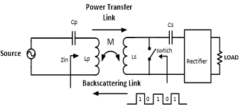

### Pakistan 1,2,3 Tapeout Projects
### 1)	Backscattering Integration for On-Chip Wireless Power Transfer (WPT) Receivers
### Introduction
Proposed project  implement WPT system having the capability of a passive backscattering using the single power transfer coils. The design goal of project will be to implement an on-chip resonant WPT system that capable of harvesting energy from external off chip coils, harvest the megnteic energy using an active recitifier and derive a load.

  
Wireless Power Transmission (WPT) is realized using resonant coils. Primary and Secondary coils are loaded with capacitors which are tuned at same frequency. Despite of low coupling coefficients MCR-WPT provides high power transfer at a single resonant frequency . Active rectification was used technique for improving the efficiency of rectification by replacing diodes with actively controlled switches with or power bipolar junction transistors.  Normal semiconductor diodes have a roughly fixed voltage drop of around 0.5-1 volts, active rectifiers behave as resistances, and can have arbitrarily low voltage drop. The voltage drop across the transistor is then much lower, which reduces the power loss. Finally an off chip ‘backscattered signal’ is used to change the impedence of coils.

### Circuit Schematic
 

### Layout
 

### 2)	Bi-Directional Amplifier Architecture for Sub-6 GHz 5G
### Introduction
 
 
